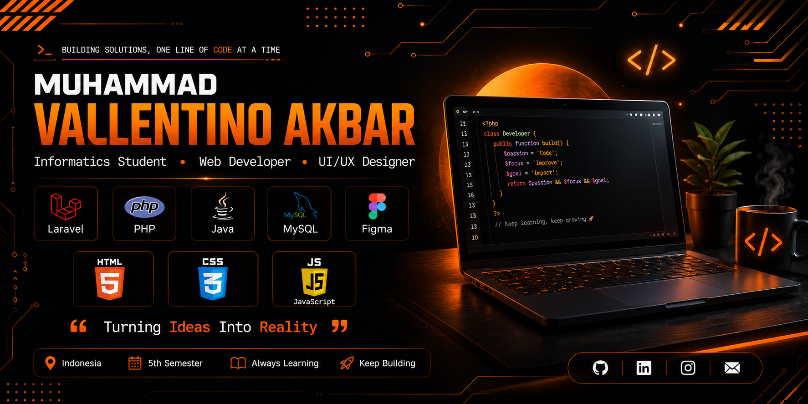

 

 
<h3 align="center">💬 "Turning Ideas Into Reality"</h3>
 

  

<h1 align="center">Hi 👋, I'm Vallentino Akbar</h1>

  🎓 5th Semester Informatics Student  
  💻 Passionate about Web Development and UI/UX Design

---

👨‍💻 About Me

- 🎓 I'm an Informatics student who enjoys learning and building web applications.
- 🌱 Currently learning **Laravel, PHP, Java, and MySQL**.
- 💡 Interested in **Web Development**, **UI/UX Design**, and **Software Engineering**.
- 🚀 I enjoy creating projects to improve my programming skills.

---

📂 Proyek Unggulan
 
| Proyek | Deskripsi |
|---|---|
| 🚗 **Car Rental Management System** | Sistem manajemen rental mobil berbasis web, dibangun dengan Laravel |
| ❤️ **Romantic Website** | Website responsif dengan animasi, musik, dan fitur interaktif |
| 📚 **Animal Education App** | Aplikasi edukasi pengenalan hewan herbivora, karnivora, dan omnivora |
| 🎨 **UI/UX Design** | Desain antarmuka dan prototipe interaktif menggunakan Figma |
 
---

🛠️ Tech Stack
 

  
  
  
  
   
  
  
  
  

---

🎯 Currently Learning

- Laravel 12
- Java Programming
- Database Design
- Figma Boys

---

📫 Contact

- 📧 Email: tvallen819@gmail.com

---

  Thanks for visiting my profile! 😊

